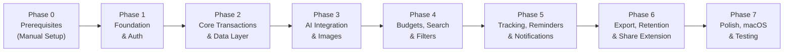
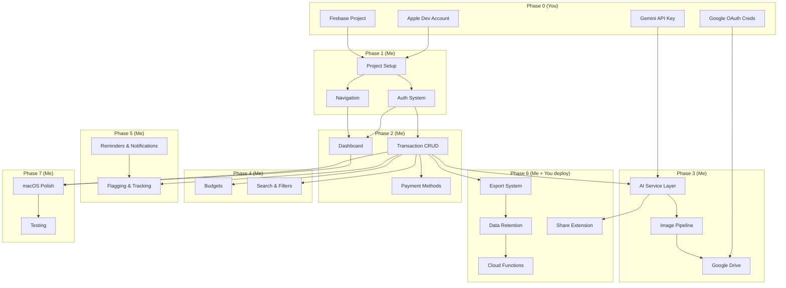

# 🗺️ FinSight — Execution Plan

> **Version:** 1.0  
> **Date:** 2026-09-29  
> **Companion to:** [PRD_FinSight.md](file:///Users/gurudev122/.gemini/antigravity/brain/f7acfcdd-0d44-445f-9a88-aca359426f11/PRD_FinSight.md)  

---

## Overview

The build is organized into **7 phases**. Each phase lists tasks, what I (AI) can do, and what requires your manual action.



---

## Phase 0: Prerequisites (Manual Setup — YOU Must Do These)

> [!CAUTION]
> These steps **cannot** be automated by me. They require access to web consoles with your accounts and credentials. Complete these before Phase 1.

### 0.1 Apple Developer Setup
| Task | Action Required | Notes |
|------|----------------|-------|
| Apple Developer Account | Sign up at [developer.apple.com](https://developer.apple.com) | Free account works for side-loading; $99/yr for TestFlight |
| Xcode 27+ | Install from Mac App Store | Required for iOS 25 / macOS 25 targets |
| Bundle ID | Decide on one (e.g., `com.yourname.finsight`) | Used across all configs |
| Signing Certificate | Create in Xcode → Preferences → Accounts | Personal Team signing for side-loading |

### 0.2 Firebase Project Setup
| Task | Action Required | Notes |
|------|----------------|-------|
| Create Firebase Project | Go to [console.firebase.google.com](https://console.firebase.google.com) → "Add Project" | Name: "FinSight" |
| Add iOS App | Project Settings → Add App → iOS → Enter bundle ID | Downloads `GoogleService-Info.plist` |
| Enable Auth Providers | Authentication → Sign-in method → Enable: Email/Password, Apple, Google | Apple requires additional setup in Apple Developer portal |
| Enable Firestore | Build → Firestore Database → Create database | Start in **test mode**, we'll add rules later |
| Enable Cloud Functions | Build → Functions → Get started | Requires Blaze (pay-as-you-go) plan for scheduled functions |
| Enable Remote Config | Build → Remote Config | For feature flags and AI prompts |

**I will provide:** All Firestore security rules, Cloud Function code, and Remote Config templates.

### 0.3 Google Cloud / Gemini Setup
| Task | Action Required | Notes |
|------|----------------|-------|
| Enable Google Drive API | [console.cloud.google.com](https://console.cloud.google.com) → APIs → Enable "Google Drive API" | Uses same project as Firebase |
| Create OAuth Client ID | APIs & Services → Credentials → Create OAuth 2.0 Client ID (iOS) | Needs bundle ID |
| Enable Gemini API | APIs → Enable "Generative Language API" (Gemini) | |
| Create Gemini API Key | APIs & Services → Credentials → Create API Key | Restrict to iOS apps + Gemini API |
| Billing | Ensure billing is enabled | Gemini has a free tier; Drive API is free for personal use |

**I will provide:** All API integration code, OAuth configuration, and API key management setup.

### 0.4 Files You'll Give Me
After completing the above, share these with me:
- [ ] `GoogleService-Info.plist` (Firebase config file)
- [ ] Google OAuth Client ID (for iOS)
- [ ] Gemini API Key
- [ ] Your chosen Bundle ID
- [ ] Your Apple Team ID

> [!TIP]
> You can store API keys in a `.env` file or use Firebase Remote Config. I'll set up secure key management in the code — never hardcoding secrets.

---

## Phase 1: Foundation & Authentication (I Build This)

**Estimated Effort:** 2-3 days of AI-assisted development

### What I Build
| Component | Description |
|-----------|-------------|
| **Xcode Project** | SwiftUI universal app targeting iOS 25+ / macOS 25+ |
| **Project Structure** | MVVM architecture with feature modules, package structure |
| **Firebase SDK Setup** | Firebase Auth, Firestore, Remote Config integration |
| **Auth Flow** | Login screen with Apple, Google, Email/Password |
| **Onboarding Carousel** | 3-slide first-launch experience |
| **Tab Navigation** | 5-tab structure (Home, Transactions, Add, Track, More) |
| **Theme System** | Light/Dark/System adaptive theming |
| **Base Models** | All data model structs/classes from PRD Section 8 |
| **Repository Layer** | Protocol-based data access layer |
| **Offline Manager** | Firestore offline persistence configuration |
| **Dependency Injection** | Environment-based DI setup |

### Deliverables
```
FinSight/
├── FinSight.xcodeproj
├── FinSight/
│   ├── App/
│   │   ├── FinSightApp.swift
│   │   ├── AppDelegate.swift
│   │   └── ContentView.swift
│   ├── Core/
│   │   ├── Models/          ← Transaction, PaymentMethod, Budget, etc.
│   │   ├── Services/        ← AuthService, FirestoreService, etc.
│   │   ├── Repositories/    ← TransactionRepo, BudgetRepo, etc.
│   │   └── Utilities/       ← Extensions, Helpers, Constants
│   ├── Features/
│   │   ├── Auth/            ← LoginView, LoginViewModel
│   │   ├── Onboarding/      ← OnboardingView
│   │   └── Navigation/      ← TabBarView, SidebarView (macOS)
│   ├── Theme/
│   │   ├── ThemeManager.swift
│   │   └── Colors+Fonts.swift
│   └── Resources/
│       ├── Assets.xcassets
│       └── GoogleService-Info.plist (placeholder)
├── FinSightTests/
└── FinSightUITests/
```

### What You Do (Phase 1)
- [ ] Drop `GoogleService-Info.plist` into the project
- [ ] Configure OAuth Client ID in the Xcode project
- [ ] Run on your device / simulator to test auth flow

---

## Phase 2: Core Transactions & Data Layer (I Build This)

**Estimated Effort:** 3-4 days

### What I Build
| Component | Description |
|-----------|-------------|
| **Dashboard View** | Summary cards, budget snapshot, quick actions, recent transactions |
| **Add Transaction** | Full form with all fields from PRD Section 6.2 |
| **Edit Transaction** | Pre-populated form, update flow |
| **Transaction Detail** | Full detail view with all metadata |
| **Transaction List** | Date-grouped list with swipe actions |
| **Payment Methods** | CRUD for cards, banks, wallets, UPI, cash |
| **Split Payments** | Multi-method payment entry with validation |
| **Firestore CRUD** | Full create/read/update/delete with offline support |
| **Sync Status** | Visual indicator for sync state |

### What You Do (Phase 2)
- [ ] Test transaction creation/editing on device
- [ ] Add your actual payment methods to verify the flow
- [ ] Report any UX issues

---

## Phase 3: AI Integration & Image Handling (I Build This)

**Estimated Effort:** 3-4 days

### What I Build
| Component | Description |
|-----------|-------------|
| **AIServiceProtocol** | Abstraction layer for AI provider (swappable) |
| **GeminiService** | Implementation using Gemini API |
| **Receipt OCR** | Image → Gemini Vision → Structured data extraction |
| **Translation** | Multi-language text → English translation |
| **Auto-Categorization** | Title + context → Category suggestions with learning loop |
| **SMS Parser** | SMS text → Transaction draft |
| **Image Compression** | Resize and compress to ≤500KB |
| **Google Drive Upload** | OAuth flow + image upload + link storage |
| **Image Viewer** | In-app image viewing from Drive links |
| **Camera / Gallery Picker** | Photo capture and selection |
| **CategoryCorrection Store** | Learning loop with few-shot prompt context |
| **Exchange Rate Service** | Gemini → Public API → Manual fallback chain |

### What You Do (Phase 3)
- [ ] Test OCR with real receipts (English + Hindi + other languages)
- [ ] Authorize Google Drive when prompted
- [ ] Verify images appear in your Google Drive
- [ ] Test SMS parsing by manually copying bank SMS into the parser

> [!IMPORTANT]
> This is the most complex phase. AI accuracy will improve over time as you correct categorization suggestions.

---

## Phase 4: Budgets, Search & Filters (I Build This)

**Estimated Effort:** 2-3 days

### What I Build
| Component | Description |
|-----------|-------------|
| **Budget Management** | Create/edit/delete budgets (overall + per category) |
| **Budget Progress** | Visual progress bars with color coding |
| **Budget Alerts** | Threshold detection (80%, 100%) |
| **Search Engine** | Full-text search across title, description, OCR text |
| **Filter System** | Multi-dimensional filtering (date, type, category, method, etc.) |
| **Filter Presets** | Save/load filter combinations |
| **Aggregate Totals** | Real-time credit/debit/net calculations on filtered results |
| **Card Reconciliation** | Filter by specific card + date range for statement matching |

### What You Do (Phase 4)
- [ ] Create some budgets and verify progress tracking
- [ ] Test search with various queries
- [ ] Try the card reconciliation flow with a real card statement

---

## Phase 5: Tracking, Reminders & Notifications (I Build This)

**Estimated Effort:** 2-3 days

### What I Build
| Component | Description |
|-----------|-------------|
| **Flagging System** | Flag/unflag transactions with notes |
| **Flagged Items View** | Dedicated view with resolve action |
| **Expected Transactions** | Create, track, match incoming credits |
| **AI Matching** | Compare new credits against expected transactions |
| **Payment Reminders** | Create reminders with recurrence |
| **Reminder Calendar** | Calendar view with dots for reminder dates |
| **Mark as Paid** | Convert reminder → actual transaction |
| **Notification Manager** | Local notifications for all alert types |
| **Daily Summary** | Scheduled local notification with day's summary |
| **Inactivity Detection** | Track last transaction time, send reminders |

### What You Do (Phase 5)
- [ ] Grant notification permissions when prompted
- [ ] Verify notifications arrive at correct times
- [ ] Test the "Expected → Matched" flow with a real refund/payment
- [ ] Set up real reminders (LIC, insurance, etc.)

---

## Phase 6: Export, Data Retention & Share Extension (I Build This)

**Estimated Effort:** 3-4 days

### What I Build
| Component | Description |
|-----------|-------------|
| **CSV Exporter** | Flat file with all transaction fields |
| **Excel Exporter** | Multi-sheet .xlsx with summaries |
| **JSON Exporter** | Structured export with schema.json |
| **PDF Generator** | Formatted ledger with receipt thumbnails |
| **Export UI** | Date range, format selection, progress |
| **Share Sheet** | iOS Share Sheet for export distribution |
| **Data Retention Engine** | 12-month rolling window logic |
| **Purge Cloud Function** | Daily scheduled function to purge old data |
| **11-Month Warning** | In-app banner + push notification |
| **Share Extension** | iOS extension for receiving images and text |
| **Extension AI Pipeline** | Process shared content through AI |
| **Recurring Detection Function** | Monthly Cloud Function for pattern analysis |

### What You Do (Phase 6)
- [ ] **Deploy Cloud Functions** (I provide the code; you run `firebase deploy --only functions`)
- [ ] Test export in all 4 formats
- [ ] Test Share Extension by sharing images/SMS from other apps
- [ ] Verify exported JSON works with your preferred AI tools

> [!WARNING]
> Cloud Functions require the Firebase **Blaze plan** (pay-as-you-go). Usage within free tier limits for personal use, but billing must be enabled.

---

## Phase 7: Polish, macOS & Testing (I Build This)

**Estimated Effort:** 2-3 days

### What I Build
| Component | Description |
|-----------|-------------|
| **macOS Layout** | Sidebar navigation, multi-column views |
| **macOS Adaptations** | Keyboard shortcuts, menu bar, window management |
| **Accessibility** | VoiceOver labels, Dynamic Type, high contrast |
| **Error Handling** | Graceful error states for all failure scenarios |
| **Loading States** | Skeleton screens, progress indicators |
| **Empty States** | Meaningful empty state illustrations and CTAs |
| **Haptic Feedback** | Subtle haptics on key actions |
| **Performance** | Lazy loading, image caching, query optimization |
| **Unit Tests** | Core business logic tests |
| **UI Tests** | Critical flow automation tests |

### What You Do (Phase 7)
- [ ] Test on real iPhone and Mac
- [ ] Test offline scenarios (airplane mode → record transactions → go online)
- [ ] Test edge cases (very large transactions, many images, etc.)
- [ ] Run the full month-end workflow (export, budget reset, etc.)

---

## What's Outside My Capabilities (Summary)

> [!IMPORTANT]
> These are the things you MUST do yourself. I cannot access web consoles, manage accounts, or test on physical devices.

| Task | Why I Can't Do It | When Needed |
|------|------------------|-------------|
| Create Apple Developer Account | Requires your identity and payment | Before Phase 1 |
| Create Firebase Project | Requires your Google account in browser | Before Phase 1 |
| Create Google Cloud OAuth credentials | Requires your Google account in browser | Before Phase 3 |
| Get Gemini API Key | Requires your Google account in browser | Before Phase 3 |
| Configure Apple Sign-In | Requires Apple Developer portal access | Before Phase 1 |
| Install Xcode 27+ | Requires Mac App Store download | Before Phase 1 |
| Run on physical device | Requires your iPhone/Mac | Each phase |
| Deploy Cloud Functions | Requires `firebase deploy` from your terminal | Phase 6 |
| Enable Firebase Blaze billing | Requires payment setup | Before Phase 6 |
| App Store submission (future) | Requires Apple Developer portal | Future |
| Physical device testing | Requires your actual devices | Ongoing |

---

## Dependency Graph



---

## Risk Assessment

| Risk | Impact | Mitigation |
|------|--------|------------|
| Gemini API rate limits | AI features degraded | Implement caching, queue requests, fallback to manual |
| Google Drive OAuth complexity | Image storage fails | Graceful fallback to local storage, retry logic |
| iOS Share Extension limitations | Data sharing between app and extension | Use App Groups for shared container |
| Firestore offline sync conflicts | Data inconsistency | Last-write-wins + conflict detection UI |
| Large image storage | Device storage fills up | Aggressive compression + Drive upload + local cleanup |
| iOS notification reliability | Missed reminders | Multiple notification channels + in-app indicators |
| Cloud Functions cold starts | Delayed scheduled tasks | Keep functions warm, use minimum instances |
| Multi-language OCR accuracy | Poor text extraction | Gemini handles this well; fallback to manual entry |

---

## Recommended Tools (for tasks outside my capabilities)

| Tool | Purpose | Cost |
|------|---------|------|
| Xcode 27+ | iOS/macOS development | Free |
| Firebase Console | Backend management | Free tier sufficient |
| Google Cloud Console | API management | Free tier for personal use |
| Figma / Sketch | Visual mockups from wireframes (optional) | Free tier available |
| TestFlight | Beta testing on devices | Requires $99/yr Apple Developer |
| Firebase CLI | Deploy Cloud Functions | Free (npm install) |
| Charles Proxy / Proxyman | Debug API calls (optional) | Free/Paid |

---

## Getting Started Checklist

When you're ready to begin building, complete these in order:

- [ ] **Step 1:** Install Xcode 27+ from Mac App Store
- [ ] **Step 2:** Create Firebase project at console.firebase.google.com
- [ ] **Step 3:** Add iOS app in Firebase with your bundle ID
- [ ] **Step 4:** Download `GoogleService-Info.plist`
- [ ] **Step 5:** Enable Firebase Auth providers (Email, Apple, Google)
- [ ] **Step 6:** Enable Cloud Firestore in test mode
- [ ] **Step 7:** Enable Gemini API in Google Cloud Console
- [ ] **Step 8:** Create Gemini API Key
- [ ] **Step 9:** Enable Google Drive API in Google Cloud Console
- [ ] **Step 10:** Create OAuth 2.0 Client ID for iOS
- [ ] **Step 11:** Tell me your Bundle ID, Team ID, and share the plist + keys
- [ ] **Step 12:** I start building Phase 1! 🚀

---

> [!NOTE]
> **Timeline Estimate:** With focused effort, the full app can be built in **10-12 weeks** of AI-assisted development. Each phase builds on the previous one, and I'll provide working, testable code at the end of each phase.
