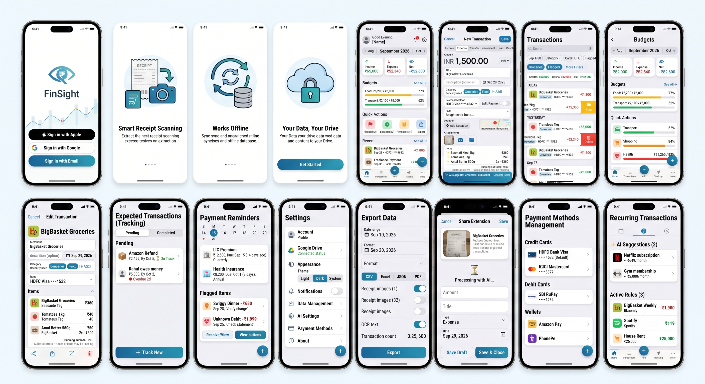
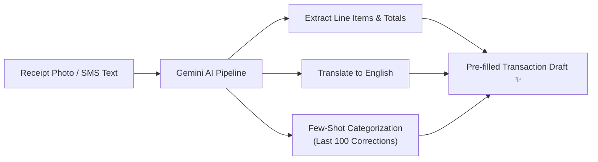
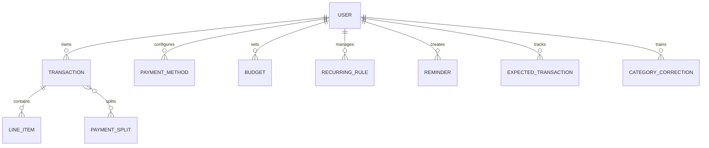
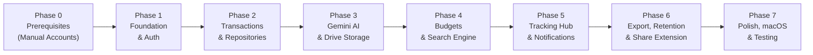

# 🧭 FinSight

> **Intelligent, Offline-First Personal Finance & Expense Manager for iOS and macOS**  
> *Universal SwiftUI application powered by Google Gemini AI, Firebase Firestore, and private Google Drive storage.*

---

[](https://swift.org)
[](https://developer.apple.com/xcode/swiftui/)
[](https://developer.apple.com)
[](https://firebase.google.com)
[](https://ai.google.dev/)
[](https://developers.google.com/drive)
[](./LICENSE)

---

## 📱 App Overview & Visual Walkthrough



---

## 📑 Table of Contents
1. [Executive Summary & Vision](#-executive-summary--vision)
2. [Core Feature Specifications](#-core-feature-specifications)
   - [Google Gemini AI Engine](#1-google-gemini-ai-engine)
   - [Transaction Management & Types](#2-transaction-management--7-transaction-types)
   - [Item-Level Tracking & Price Comparison](#3-item-level-tracking--price-comparison)
   - [Budgets & Analytics](#4-budgets--financial-analytics)
   - [Tracking Hub & Bill Reminders](#5-tracking-hub--bill-reminders)
   - [Data Retention & 4 Export Formats](#6-data-retention--4-export-formats)
   - [System Share Extension](#7-system-share-extension)
   - [Notification Matrix](#8-notification-matrix)
3. [Screen Wireframes & User Experience](#-screen-wireframes--user-experience)
4. [Data Architecture & Firestore Schemas](#-data-architecture--firestore-schemas)
5. [Codebase Architecture & Directory Layout](#-codebase-architecture--directory-layout)
6. [7-Phase Execution Plan & Roadmap](#-7-phase-execution-plan--roadmap)
7. [Installation & Setup Guide](#-installation--setup-guide)
8. [Future Platform Expansion (Android)](#-future-platform-expansion-android)

---

## 💡 Executive Summary & Vision

**FinSight** is an offline-first, private personal finance and expense tracking application designed for **iOS 25+** and **macOS 25+** as a universal SwiftUI app. It bridges the gap between tedious manual expense logging and privacy-invasive bank scrapers by uniting:

* **Deep AI Integration:** Google Gemini processes receipt images, extracts itemized products, translates regional Indian languages, auto-categorizes transactions, and parses bank SMS notifications.
* **100% Offline Capability:** All ledger operations function without internet access using Cloud Firestore's local cache. Sync occurs in the background when connectivity resumes.
* **Zero-Trust Private Image Storage:** Receipt photos are uploaded directly to a dedicated `FinSight` folder in the user's personal **Google Drive** via OAuth 2.0. No images are hosted on third-party servers.
* **Product-Level Price Comparison:** Transactions capture individual line items, enabling users to search historical purchase prices (e.g. *"Tomatoes"* or *"Cooking Oil"*) across stores to track inflation and find the best prices.
* **Data Sovereignty:** 12-month rolling data retention window with proactive reminders and 4 export formats (CSV, Excel, JSON with schema, PDF).

---

## 🌟 Core Feature Specifications

### 1. Google Gemini AI Engine
* **Multilingual Receipt OCR & Translation:** Sends compressed receipt photos ($\le 500\,\text{KB}$, max 1920px) to Gemini. Recognizes merchant, transaction date, payment hints, totals, and line items across English, Hindi, Tamil, Kannada, Telugu, and other Indian regional languages. Automatically translates item names to English.
* **Automated Line-Item Itemization:** Parses individual products on receipts into `LineItem` objects (product name, quantity, unit of measure, unit price, and line total) presented with an AI sparkle (`✨`) badge for review.
* **Adaptive Auto-Categorization (Few-Shot Loop):** When suggesting 1–3 category labels, Gemini evaluates the title, description, OCR text, and the last 100 user corrections stored in the `CategoryCorrections` collection.
* **Bank SMS Parsing:** Ingests transaction alert texts shared through the iOS Share Extension. Extracts amount, merchant, date, account/card last-4, and debit/credit status across major Indian banks (HDFC, SBI, ICICI, Axis, Kotak, etc.).
* **Recurring Pattern Detection:** Background Cloud Function analyzes the past 6 months of transaction history on the 1st of every month to identify recurring payments (same merchant $\pm 10\%$ amount variance) and suggest `RecurringRule` templates.
* **Exchange Rate Fallback Chain:** Resolves foreign currency conversions on the exact transaction date via: `Gemini API` $\rightarrow$ `Public Exchange Rate API (open.er-api.com)` $\rightarrow$ `Manual Input`.



---

### 2. Transaction Management & 7 Transaction Types
Every transaction supports multi-currency entries, split payments, geolocations, notes, and attachments:

| Type | Flow | Direction | Examples |
|---|---|---|---|
| **Expense** | Outflow | Debit (−) | Groceries, dining, utility bills, shopping |
| **Income** | Inflow | Credit (+) | Salary, client retainers, dividends, interest |
| **Transfer** | Neutral | Neutral (0) | Savings $\rightarrow$ Checking, Bank $\rightarrow$ Online Wallet |
| **Investment** | Asset Outflow | Debit (−) | Mutual Funds, SIPs, Stocks, Fixed Deposits |
| **Loan Given** | Asset Outflow | Debit (−) | Money lent to friends or family |
| **Loan Received** | Liability Inflow | Credit (+) | Money borrowed |
| **Cashback** | Inflow | Credit (+) | Card reward points redeemed, merchant cashbacks |

* **Split Payments:** Allows dividing a single bill across 2+ payment methods (e.g. ₹1,500 total split into ₹1,000 Credit Card + ₹500 Wallet).
* **Location & Geotagging:** Optional Apple Maps GPS integration with reverse geocoding (place name + full street address) and a tappable mini-map preview.

---

### 3. Item-Level Tracking & Price Comparison
FinSight captures granular items within receipts to answer: *"Where did I get the cheapest price for this product over the past year?"*

* **Line Items Capture:** Extracted by AI from receipts or entered manually (Name, Translated Name, Quantity, Unit, Unit Price, Line Total).
* **Subtotal Validation:** Displays a running subtotal of all items. If item total differs from transaction amount, a note displays: *"Subtotal differs from total — may be due to taxes, discounts, or missing items."*
* **Product Search Filter:** Dedicated search bar for line-item names across all 12 months of records. Results highlight matching items, merchant, and unit prices.

---

### 4. Budgets & Financial Analytics
* **Scopes & Cadence:** Supports Overall Monthly/Weekly budgets and Per-Category budgets.
* **Threshold Color Tiers:**
  * 🟢 **Green:** $< 60\%$ utilized
  * 🟡 **Yellow:** $60\% - 80\%$ utilized
  * 🟠 **Orange:** $80\% - 95\%$ utilized (triggers push notification)
  * 🔴 **Red:** $> 95\%$ utilized (triggers critical push alert at $100\%$)
* **Sticky Aggregate Summary Bar:** Sticky bar on transaction lists displaying live sums:
  $$\text{Total Credits} \quad|\quad \text{Total Debits} \quad|\quad \text{Net Balance} \quad|\quad \text{Count}$$

---

### 5. Tracking Hub & Bill Reminders
* **Expected Transactions:** Log expected incoming money (refunds, reimbursements). When a matching credit is recorded, AI auto-matches: *"Amazon refund for ₹2,499 seems completed. Confirm link?"*
* **Flagged Items Queue:** Mark ambiguous transactions for follow-up with custom notes. Generates daily reminder badges until resolved.
* **Bill & Due Date Reminders:** Tracks manual recurring payments (LIC policies, health insurance, rent) with notifications 3 days before, 1 day before, and on the due date.

---

### 6. Data Retention & 4 Export Formats
* **Rolling 12-Month Window:** Data older than 365 days is purged daily by a Cloud Function at 2:00 AM IST. Drive images are **never** deleted, ensuring receipts remain permanently in your personal cloud.
* **30-Day Expiration Warnings:** Proactive in-app banner and weekly notifications begin on Day 335 to prompt data export.
* **Export Pipeline:**
  1. **CSV:** Flat comma-separated format for quick spreadsheet analysis.
  2. **Excel (.xlsx):** Multi-tab formatted workbook (`Transactions`, `LineItems`, `PaymentMethods`, `Summary`).
  3. **JSON:** Machine-readable tree export packaged with `schema.json` for AI workflows.
  4. **PDF:** Human-readable ledger containing monthly breakdown tables and embedded receipt image thumbnails.

---

### 7. System Share Extension
* Allows logging directly from Photos, Files, or Messages without opening FinSight:
  * **Share Image:** Triggers background OCR compression and generates a pre-filled draft.
  * **Share Text:** Triggers SMS parser to extract merchant, amount, card last-4, and date.

---

### 8. Notification Matrix

| Notification Event | Channel | Trigger Timing | Purpose |
|---|---|---|---|
| **Daily Summary** | Local Push | Daily at 8:00 PM (User configurable) | Summary of today's total spending |
| **Budget 80% Warning** | Local Push | Immediate upon transaction save | Warning before exceeding category limit |
| **Budget 100% Alert** | Local Push | Immediate upon transaction save | Critical alert: budget exceeded |
| **Flagged Transactions** | Local Push | Daily at 9:00 AM | Nudge to review flagged transactions |
| **Payment Due Reminders**| Local Push | 3 days before, 1 day before, due date | Prevent missed insurance or loan dates |
| **Expected Overdue** | Local Push | Daily at 10:00 AM | Alert for pending incoming refunds |
| **Inactivity Alert** | Local Push | 48 hours without transaction | Reminder to log recent SMS or receipts |
| **Export Warning (Day 335)**| Push + Banner | Weekly starting 30 days before purge | Reminder to back up expiring records |
| **Recurring Suggestions**| In-App Card | 1st of month on launch | Accept detected recurring subscriptions |

---

## 🖼️ Screen Wireframes & User Experience

FinSight features a responsive layout: a **5-Tab Navigation** on iPhone and an **Adaptive Navigation Sidebar** on iPad and macOS.

### Screen 1: Dashboard (Home Screen)
```text
┌──────────────────────────────────────────────────┐
│ Good Evening, Alex                         ⚙️ 🔔³│
├──────────────────────────────────────────────────┤
│  ← Aug 2026   │  ▪ September 2026 ▪  │   Oct 2026 →│
├──────────────────────────────────────────────────┤
│ ┌──────────────┐ ┌──────────────┐ ┌────────────┐ │
│ │ Income       │ │ Expense      │ │ Net        │ │
│ │ ↑ ₹85,000    │ │ ↓ ₹52,340    │ │ +₹32,660   │ │
│ │ (Green)      │ │ (Red)        │ │ (Blue)     │ │
│ └──────────────┘ └──────────────┘ └────────────┘ │
├──────────────────────────────────────────────────┤
│ Budgets                                 See All →│
│ ┌──────────────────────────────────────────────┐ │
│ │ Food: ₹6,200 / ₹8,000      [▓▓▓▓▓▓▓▓░░] 77%🟡 │ │
│ │ Transport: ₹2,100 / ₹5,000 [▓▓▓▓░░░░░░] 42%🟢 │ │
│ └──────────────────────────────────────────────┘ │
├──────────────────────────────────────────────────┤
│ Quick Actions                                    │
│ ┌──────────┐ ┌──────────┐ ┌──────────┐ ┌───────┐ │
│ │ 🚩 Flag 3│ │ 📥 Exp. 2│ │ ⏰ Rem. 1│ │ 📤Exp│ │
│ └──────────┘ └──────────┘ └──────────┘ └───────┘ │
├──────────────────────────────────────────────────┤
│ Recent Transactions                     See All →│
│ 🛒 BigBasket Groceries  · Sep 29 · HDFC ····4532 │ -₹1,500
│ 💼 Freelance Payment   · Sep 29 · Bank Transfer │ +₹15,000
│ 🍽 Swiggy Dinner [🚩]  · Sep 28 · Amazon Pay   │   -₹680
└──────────────────────────────────────────────────┘
```

### Screen 2: Add / Edit Transaction
```text
┌──────────────────────────────────────────────────┐
│ [Cancel]          New Transaction         [Save] │
├──────────────────────────────────────────────────┤
│ [Income]  [• Expense]  [Transfer]  [Investment]  │
│                                                  │
│  Amount: ₹ [ 1,500.00 ]          Currency: [INR] │
│  Title:  [ BigBasket Groceries                 ] │
│  Date:   [ Today, Sep 29, 2026                 ] │
│                                                  │
│  Categories: [Groceries] [Food] [+ Add Tag]     │
│  Payment Method: [ HDFC Visa Credit ····4532  ▼] │
│  [x] Split Payment: ₹1000 HDFC + ₹500 AmazonPay  │
│                                                  │
│  Note: "Weekly produce and fruit order"          │
│  Location: 📍 Indiranagar, Bangalore (Mini-Map)  │
│                                                  │
│  Receipts: [📷 Camera] [🖼 Gallery] [📎 Files]    │
│  Items Extracted (3) ✨                         │
│  • Basmati Rice 5kg      1 pcs  @ ₹350 = ₹350    │
│  • Tomatoes              1 kg   @ ₹40  = ₹40     │
│  • Amul Butter 500g      2 pcs  @ ₹280 = ₹560    │
│    Running Subtotal: ₹950 (Subtotal differs note)│
│                                                  │
│  Additional: [x] Recurring  [ ] Flag  [ ] Shared │
└──────────────────────────────────────────────────┘
```

### Screen 3: Transaction Ledger & Search
```text
┌──────────────────────────────────────────────────┐
│ 🔍 Search title, notes, OCR, or products...      │
│ [Date Range ▼] [Type ▼] [Category ▼] [Card ▼]    │
├──────────────────────────────────────────────────┤
│  Credits: ₹85,000 | Debits: ₹52,340 | Net: +₹32,660
├──────────────────────────────────────────────────┤
│ TODAY                                            │
│   🛒 BigBasket Groceries                         │
│      Groceries · HDFC ····4532           -₹1,500 │
│   💼 Client Retainer                             │
│      Income · Bank Transfer              +₹15,000│
│ YESTERDAY                                        │
│   🍽 Swiggy Dinner  🚩                          │
│      Dining · Amazon Pay                   -₹680 │
│   ⛽ Shell Petrol                                │
│      Transport · SBI Debit ····1234      -₹1,200 │
└──────────────────────────────────────────────────┘
```

---

## 🗄️ Data Architecture & Firestore Schemas

### Entity Relationship Model



### Firestore Collection Hierarchy
```text
users/{userId}/
├── profile                     # User preferences, currency, Google Drive token status
├── transactions/{txId}         # Core financial ledger documents
├── paymentMethods/{pmId}       # Credit/Debit cards, UPI IDs, wallets, accounts
├── budgets/{budgetId}          # Monthly & weekly budget spending ceilings
├── recurringRules/{ruleId}     # Auto-generation schedules for subscriptions
├── reminders/{reminderId}      # Manual bill due-date reminders (LIC, insurance)
├── expectedTransactions/{etId} # Tracked incoming refunds and receivables
├── categoryCorrections/{ccId}  # AI few-shot training history (last 100 corrections)
└── exportHistory/{exportId}    # Audit trail of data exports and purge cycles
```

### JSON Document Schemas

<details>
<summary><b>1. Transaction Document (`transactions/{txId}`)</b></summary>

```json
{
  "id": "c8b417e2-48e7-4b72-a9b0-9b4b62db1234",
  "type": "expense",
  "amount": 1500.00,
  "currency": "INR",
  "exchangeRate": null,
  "equivalentINR": 1500.00,
  "title": "BigBasket Groceries",
  "description": "Weekly essentials & pantry restock",
  "date": "2026-09-29T10:30:00Z",
  "categories": ["Groceries", "Food"],
  "paymentSplits": [
    { "methodId": "pm_hdfc_4532", "amount": 1000.00 },
    { "methodId": "pm_amazon_pay", "amount": 500.00 }
  ],
  "receiptLinks": [
    "https://drive.google.com/file/d/1A2B3C4D5E6F/view"
  ],
  "localImagePaths": [],
  "ocrText": "BigBasket Supermarket... Items: 3 Total: Rs 1500",
  "translatedText": null,
  "note": "Purchased extra fruits for weekend guests",
  "location": {
    "latitude": 12.9716,
    "longitude": 77.5946
  },
  "locationName": "Indiranagar, Bangalore",
  "locationAddress": "12th Main Road, Indiranagar, Bengaluru, KA 560038",
  "items": [
    {
      "name": "Basmati Rice 5kg",
      "nameTranslated": null,
      "quantity": 1.0,
      "unit": "pcs",
      "unitPrice": 350.00,
      "lineTotal": 350.00,
      "source": "ocr"
    },
    {
      "name": "Tomatoes",
      "nameTranslated": null,
      "quantity": 1.0,
      "unit": "kg",
      "unitPrice": 40.00,
      "lineTotal": 40.00,
      "source": "ocr"
    },
    {
      "name": "Amul Butter 500g",
      "nameTranslated": null,
      "quantity": 2.0,
      "unit": "pcs",
      "unitPrice": 280.00,
      "lineTotal": 560.00,
      "source": "manual"
    }
  ],
  "isRecurring": false,
  "recurringRuleId": null,
  "recurringFrequency": null,
  "isFlagged": false,
  "flagNote": null,
  "isShared": true,
  "sharedWith": "Spouse",
  "isExpected": false,
  "expectedTransactionId": null,
  "source": "ocr",
  "syncStatus": "synced",
  "createdAt": "2026-09-29T10:35:00Z",
  "updatedAt": "2026-09-29T10:35:00Z"
}
```
</details>

<details>
<summary><b>2. Payment Method Document (`paymentMethods/{pmId}`)</b></summary>

```json
{
  "id": "pm_hdfc_4532",
  "type": "credit_card",
  "bankName": "HDFC Bank",
  "last4": "4532",
  "cardNetwork": "Visa",
  "walletName": null,
  "upiId": null,
  "nickname": "Millennia Credit Card",
  "isDefault": true,
  "createdAt": "2026-09-01T00:00:00Z"
}
```
</details>

<details>
<summary><b>3. Budget Document (`budgets/{budgetId}`)</b></summary>

```json
{
  "id": "bgt_food_monthly",
  "period": "monthly",
  "category": "Food",
  "limitAmount": 8000.00,
  "isOverall": false,
  "createdAt": "2026-09-01T00:00:00Z"
}
```
</details>

<details>
<summary><b>4. Expected Transaction Document (`expectedTransactions/{etId}`)</b></summary>

```json
{
  "id": "et_amazon_refund",
  "source": "Amazon India",
  "expectedAmount": 2499.00,
  "amountTolerance": 0.05,
  "expectedBy": "2026-10-05T00:00:00Z",
  "notes": "Refund for returned headphones",
  "status": "pending",
  "matchedTransactionId": null,
  "createdAt": "2026-09-28T14:00:00Z"
}
```
</details>

<details>
<summary><b>5. Reminder Document (`reminders/{remId}`)</b></summary>

```json
{
  "id": "rem_lic_policy",
  "title": "LIC Term Plan Premium",
  "amount": 12500.00,
  "dueDate": "2026-10-15T00:00:00Z",
  "recurrence": "quarterly",
  "notes": "Policy #098765432",
  "isCompleted": false,
  "linkedTransactionId": null,
  "notifyDaysBefore": [3, 1, 0],
  "createdAt": "2026-09-01T00:00:00Z"
}
```
</details>

<details>
<summary><b>6. Category Correction Document (`categoryCorrections/{ccId}`)</b></summary>

```json
{
  "id": "cc_9872",
  "originalSuggestion": ["Shopping"],
  "correctedTo": ["Groceries", "Food"],
  "transactionTitle": "BigBasket Order",
  "ocrContext": "BigBasket Fresh Fruits and Dairy items",
  "createdAt": "2026-09-29T10:35:00Z"
}
```
</details>

---

## 🏛️ Codebase Architecture & Directory Layout

The application adheres to **Clean Architecture** and **MVVM** principles using Swift Concurrency (`async`/`await`, `actors`) with protocol-based repository isolation.

```text
FinSight/
├── FinSight.xcodeproj/                # Generated project file (via XcodeGen)
├── project.yml                        # Declarative project specification
├── FinSight/
│   ├── App/
│   │   ├── FinSightApp.swift          # Main @main entry point & lifecycle
│   │   └── ContentView.swift          # Root view selector & auth state router
│   ├── Config/
│   │   ├── AppConfig.swift            # Global runtime configuration
│   │   └── Secrets.plist              # API keys & client IDs (git-ignored)
│   ├── Core/
│   │   ├── DependencyContainer.swift  # Dependency Injection hub
│   │   ├── Models/                    # Decodable models matching Firestore schema
│   │   │   ├── Transaction.swift
│   │   │   ├── LineItem.swift
│   │   │   ├── Budget.swift
│   │   │   ├── PaymentMethod.swift
│   │   │   ├── Reminder.swift
│   │   │   ├── ExpectedTransaction.swift
│   │   │   ├── RecurringRule.swift
│   │   │   └── CategoryCorrection.swift
│   │   ├── Repositories/              # Protocol abstractions & Firestore implementations
│   │   │   ├── TransactionRepository.swift
│   │   │   ├── BudgetRepository.swift
│   │   │   └── PaymentMethodRepository.swift
│   │   └── Services/                  # Protocol-driven external integrations
│   │       ├── GeminiAIService.swift          # Vision OCR, line items, prompts
│   │       ├── FirebaseAuthService.swift      # Apple, Google, Email auth
│   │       ├── FirestoreService.swift         # Offline database client
│   │       ├── GoogleDriveService.swift       # OAuth 2.0 multipart image uploads
│   │       ├── ImageCompressionService.swift  # Client-side 500KB JPEG optimizer
│   │       ├── ExportService.swift            # CSV, Excel, JSON, PDF generator
│   │       └── LocalNotificationService.swift # Trigger-based notification manager
│   ├── Features/                      # UI modules (SwiftUI Views + ViewModels)
│   │   ├── Auth/                      # Login & password reset views
│   │   ├── Onboarding/                # 3-slide introduction carousel
│   │   ├── Dashboard/                 # Home summary cards, budget status, recent txns
│   │   ├── Transactions/              # Add/edit forms, filter sheets, camera scanner
│   │   ├── Budget/                    # Visual progress meters, category budgets
│   │   ├── Tracking/                  # Expected transactions, flagged items queue
│   │   ├── Reminders/                 # Calendar due dates & recurring alerts
│   │   ├── Settings/                  # Drive status, appearance, data export UI
│   │   └── Navigation/                # TabView (iOS) & Sidebar (macOS/iPad)
│   ├── Theme/                         # AppColors, AppFonts, Dynamic Type ThemeManager
│   └── Utilities/                     # Extensions (Date, Decimal, Color, View)
├── FinSightShareExtension/            # iOS Share Sheet extension (OCR & SMS capture)
└── FinSightTests/                     # Comprehensive Unit and Integration tests
```

---

## 🗺️ 7-Phase Execution Plan & Roadmap



### Phase 0: Prerequisites & Manual Developer Setup
1. **Apple Developer Portal:** Create App Bundle ID (`com.yourname.finsight`) and generate iOS/macOS Signing Certificates.
2. **Firebase Console:**
   * Create `FinSight` project.
   * Enable Authentication providers: **Sign in with Apple**, **Google Sign-In**, and **Email/Password**.
   * Provision **Cloud Firestore** in production mode.
   * Upgrade to Blaze plan (for Cloud Functions cron triggers).
   * Download `GoogleService-Info.plist`.
3. **Google Cloud Console:**
   * Enable **Google Drive API** and create iOS OAuth 2.0 Client ID (Scope: `drive.file`).
   * Enable **Generative Language API** and create a restricted **Gemini API Key**.

### Phase 1: Foundation & Authentication
* Scaffold SwiftUI Universal project targeting iOS 25+ / macOS 25+.
* Set up `DependencyContainer` and base `ThemeManager` with adaptive Dark/Light mode.
* Implement Sign in with Apple, Google, and Email/Password with session persistence.
* Build the 3-slide onboarding carousel.

### Phase 2: Core Transactions & Local Data Layer
* Implement the 7 Transaction types, multi-currency support, split payments, and notes.
* Integrate CoreLocation and Apple Maps for geocoding and reverse geocoding.
* Build protocol-based `TransactionRepository` utilizing Firestore's offline cache.

### Phase 3: AI Integration & Image Pipeline
* Integrate `GeminiAIService` for multi-lingual receipt OCR and translation.
* Build line-item extraction to pre-populate product drafts with `✨` indicators.
* Implement few-shot category learning using `CategoryCorrections`.
* Implement `GoogleDriveService` with OAuth 2.0 to upload compressed images ($\le 500\,\text{KB}$).

### Phase 4: Budgets, Search & Filtering
* Build overall and category-specific weekly/monthly budget management.
* Implement real-time progress meters with color stages (Green, Yellow, Orange, Red).
* Create multi-criteria search and dedicated line-item product search.
* Build the sticky summary totals bar.

### Phase 5: Tracking Hub, Reminders & Notifications
* Implement Expected Transactions tracker with auto-credit reconciliation.
* Create Flagged Transactions review queue with daily reminders.
* Build Calendar-based Bill Reminders with 3-day, 1-day, and due-day notifications.

### Phase 6: Data Export, Retention & Share Extension
* Implement daily Cloud Function purge at 2:00 AM IST for transactions older than 365 days.
* Add Day 335 (Month 11) proactive export warning banners.
* Build 4-format local export generator: **CSV**, **Excel (.xlsx)**, **JSON (with `schema.json`)**, and **PDF**.
* Build `FinSightShareExtension` for system-wide receipt and SMS parsing.

### Phase 7: Polish, macOS Optimization & Testing
* Optimize responsive multi-column Sidebar layout for macOS 25+ and iPadOS 25+.
* Dynamic Type and VoiceOver accessibility audit.
* Execute unit test suites in `FinSightTests` for repositories, models, and calculation edge cases.

---

## 🛠️ Installation & Setup Guide

### 1. Clone the Project
```bash
git clone https://github.com/your-username/FinSight.git
cd "FinSight"
```

### 2. Configure Firebase Credentials
Place your downloaded `GoogleService-Info.plist` inside:
```text
FinSight/FinSight/Resources/GoogleService-Info.plist
```

### 3. Configure Secrets (`Secrets.plist`)
Create `FinSight/FinSight/Config/Secrets.plist` (git-ignored) with your credentials:
```xml
<?xml version="1.0" encoding="UTF-8"?>
<!DOCTYPE plist PUBLIC "-//Apple//DTD PLIST 1.0//EN" "http://www.apple.com/DTDs/PropertyList-1.0.dtd">
<plist version="1.0">
<dict>
    <key>GEMINI_API_KEY</key>
    <string>YOUR_ACTUAL_GEMINI_API_KEY</string>
    <key>GOOGLE_DRIVE_CLIENT_ID</key>
    <string>YOUR_GOOGLE_DRIVE_OAUTH_CLIENT_ID</string>
</dict>
</plist>
```

### 4. Generate Xcode Project
If you have [XcodeGen](https://github.com/yonaskolb/XcodeGen) installed, regenerate the `.xcodeproj`:
```bash
brew install xcodegen   # If not installed
cd FinSight
xcodegen generate
```

### 5. Build & Run
1. Open `FinSight/FinSight.xcodeproj` in **Xcode 27+**.
2. Select your Signing Team in **Signing & Capabilities**.
3. Select your run destination (**iPhone 17 Pro** or **My Mac**).
4. Press `Cmd + R` to compile and launch.

---

## 🤖 Future Platform Expansion (Android)

FinSight was architected from Day 1 for multi-platform parity:
* **Shared Cloud Architecture:** Android client connects to the identical Cloud Firestore collection structure and Firebase Auth system.
* **Native Android SMS Access:** While iOS uses the Share Extension due to OS sandboxing, the planned Android version (Kotlin / Jetpack Compose) will leverage `RECEIVE_SMS` permissions to run an autonomous background listener for incoming bank transaction alerts.
* **Portable Schemas:** The JSON export structure and Firestore field names are platform-agnostic.

---

## 📄 License

This repository is maintained for personal use under the **MIT License**.
See the [LICENSE](./LICENSE) file for complete terms.
